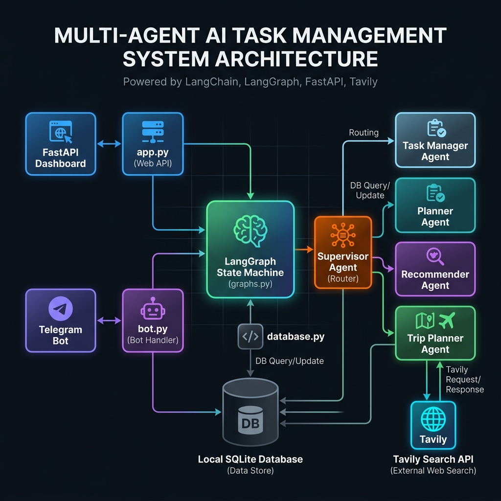

# Multi-Agent AI Task Management System

An AI-powered, multi-agent task management system that integrates a FastAPI web dashboard and an interactive Telegram bot client. The system parses natural language user requests, manages tasks, provides intelligent productivity recommendations, and proactively schedules morning overview summaries.

Built using **FastAPI**, **LangChain** & **LangGraph** (multi-agent orchestration), **python-telegram-bot**, and **aiosqlite** (asynchronous SQLite).

---

## 🚀 Key Features
* **Interactive Telegram Bot**: Fully integrated Telegram client supporting command shortcuts (`/tasks`, `/overdue`, `/summary`) and natural language interactions.
* **Multi-Agent Orchestration**: Orchestrated using LangGraph in a modular *Supervisor-Worker-Reviewer* pattern.
* **Natural Language Chat**: Manage tasks through Telegram or the dashboard chat window (e.g. *"Create a high priority task for John to deploy frontend by Friday"*).
* **Intelligent Date & Priority Resolution**: Agents dynamically inspect today's date to resolve relative terms (e.g. *"tomorrow"*, *"by Friday"*) and prioritize tasks (High, Medium, Low) based on deadlines.
* **Proactive Autonomous Assistance**: An integrated async `JobQueue` scheduler runs inside the bot to send daily morning summaries and overdue task reminders.
* **Asynchronous Database**: Scalable, thread-safe asynchronous database transactions using `aiosqlite` to prevent event-loop lockups.
* **Web Dashboard**: Interactive visual panel to filter (All, Pending, In Progress, Completed), search, and create tasks manually.

---

## 🛠️ System Architecture

The project is structured into clean boundary layers:

```
[bot.py / app.py] (API / Bot Clients)
       │ (run_pipeline / tool.ainvoke)
       ▼
  [graphs.py] (LangGraph StateMachine Compile)
       │ (pipeline.ainvoke)
       ▼
  [agents.py] (Cognitive Agent Nodes & Router)
       │ (llm.ainvoke / tool.ainvoke)
       ▼
   [tools.py] (LangChain Async Tools)
       ├── (database_func) ──> [database.py] (Async SQLite via aiosqlite)
       └── (search_travel) ──> [Tavily Search API] (External Web Search)
```

### Cognitive Agent Roles:
1. **Supervisor Agent (Router)**: The entry point. Classifies intent and routes execution to the correct worker.
2. **Task Manager Agent**: Executes CRUD operations (create, update, delete, complete) via database tools.
3. **Planner Agent**: Decomposes complex user requests into logical, sequential subtasks.
4. **Recommender Agent**: Analyzes active/overdue tasks and compiles morning productivity advice.
5. **Trip Planner Agent**: Researches travel details (flights, hotels, destinations) and compiles custom travel itineraries via the Tavily Search API.
6. **Reviewer Agent**: Validates output and determines if a retry is needed (`APPROVED` or `NEEDS_RETRY`).

---

## 📦 Installation & Setup

### 1. Clone and Navigate
```bash
git clone <https://github.com/RahulMaheshwari12/multi-agent-task-manager>
cd multi-agent-task-manager-hybrid
```

### 2. Install Dependencies
Ensure you have Python 3.9+ installed, then run:
```bash
pip install -r requirements.txt
```

### 3. Environment Configuration
Create a `.env` file at the root of the project:
```env
TELEGRAM_BOT_TOKEN="your_telegram_bot_token"
GROQ_API_KEY="your_groq_api_key"
USE_GROQ="true"
```

---

## 🖥️ Running the Application

For a fully working setup, you must run both the backend server and the Telegram bot in separate terminal tabs:

### 1. Run the FastAPI Backend & Dashboard
```bash
python app.py
```
* The database will initialize automatically: `✅ Database initialized`.
* Open your browser and visit the dashboard: **`http://127.0.0.1:8000/dashboard`**.

### 2. Run the Telegram Bot
```bash
python bot.py
```
* Connect with your bot on Telegram and type `/start` to register.
* Test commands: `/tasks`, `/overdue`, `/summary`, or chat in plain English.

---

## 📂 Project Structure
* `database.py`: Async SQLite database setup and raw CRUD SQL queries.
* `tools.py`: LangChain tools wrapping async database functions.
* `agents.py`: Agent prompts, node declarations, state schemas, and graph routers.
* `graphs.py`: LangGraph state machine builder and pipeline compilation.
* `app.py`: FastAPI server routes (REST endpoints, lifespan, static mounting).
* `bot.py`: Telegram bot command handlers and JobQueue scheduler.
* `static/`: Frontend dashboard assets (`index.html`, `script.js`, `style.css`).

---

## 📐 System Architecture Diagram


---

## 🔬 HiDevs Architecture Copilot Evaluation

As required by the assignment design parameters, here is the evaluation and critique of the architecture diagram generated by the HiDevs Copilot tool:

> **Note on Diagram Export**: The built-in PNG export feature of the Architecture Copilot tool suffered from viewport truncation and compression artifacts. To preserve structural legibility and prevent blurry text, the diagram was scaled to fit the canvas and captured via high-resolution viewport clipping.

### 1. What was Successful (What I Liked)
* **Layer Isolation**: The diagram cleanly isolates user interfaces (Web/Telegram), server runtimes (FastAPI/python-telegram-bot), multi-agent cognitive layers, and data storage.
* **Proactive Scheduling Integration**: The flow from the `JobQueue Scheduler` service to the `Supervisor` node correctly maps our proactive morning summary design.

### 2. Discrepancies & Corrections (What I Changed)
* **Database I/O Routing**: 
  * *Copilot Diagram*: Connects the database directly to the `Reviewer Agent`.
  * *Actual Implementation*: The Reviewer does not perform database read/write actions. Instead, the database is queried by the **Task Manager**, **Planner**, and **Recommender** agents using the async LangChain tools. The Reviewer only evaluates the final formatted string outcomes.
* **API Entrypoint Integration**:
  * *Copilot Diagram*: Connects the `FastAPI Server` directly to the `Supervisor` node.
  * *Actual Implementation*: The FastAPI endpoints call `run_pipeline()`, which launches the entire compiled LangGraph state machine wrapper rather than routing to individual agent nodes directly.

### 3. Areas for Future Improvement
* **User Session Partitioning**: In a multi-user environment, we should introduce a `users` table and a `user_chat_id` foreign key constraint in the `tasks` table, allowing multiple users to use the bot concurrently without shared state issues.
* **Async Event Loop Database Drivers**: The current implementation runs fully asynchronously via `aiosqlite`. A next step would be moving to a connection-pooled production async database like PostgreSQL with an ORM like SQLModel or SQLAlchemy to allow horizontally scaling the API and bot containers.
